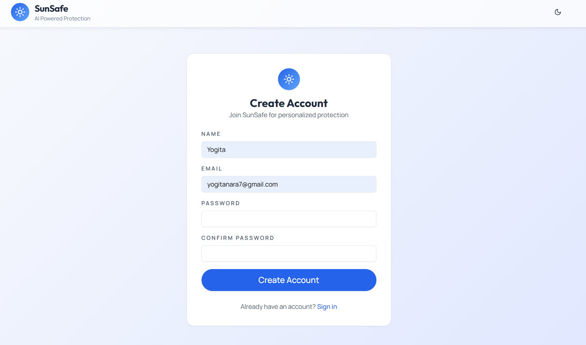
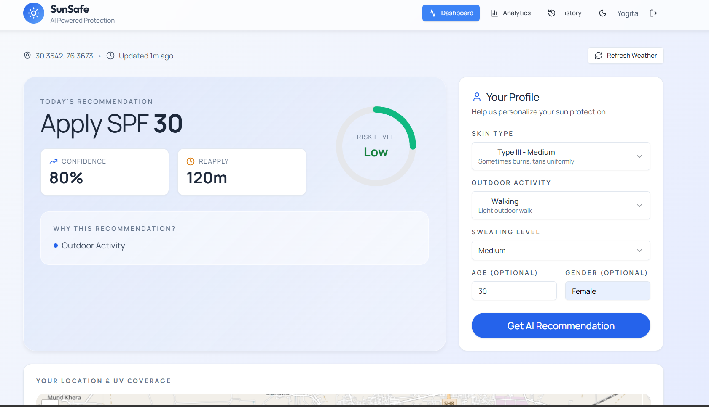
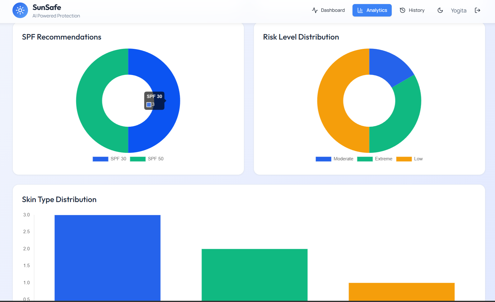
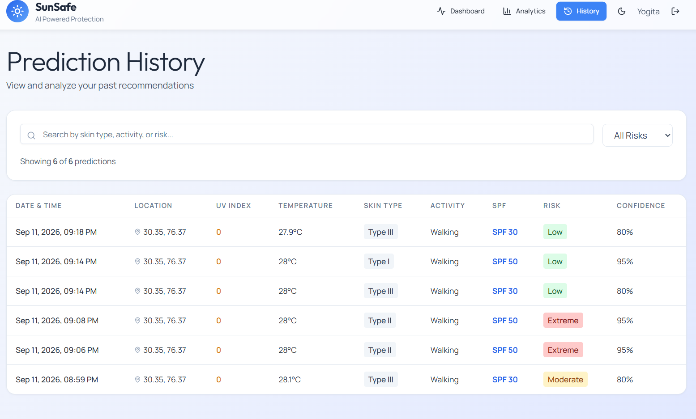

# ☀️ SunSafe

An AI-powered web application that provides personalized sunscreen recommendations based on live weather conditions, UV index, and user-specific skin information. The application combines weather intelligence, machine learning, and geolocation to help users make informed sun protection decisions — behind a secure, per-account login.

---

## Overview

SunSafe was built to simplify sunscreen selection by combining environmental conditions with personal skin characteristics. Instead of recommending products based on SPF alone, the application considers multiple real-world factors such as UV intensity, weather conditions, skin type, outdoor exposure, and user preferences.

Each user signs up for their own account. Once signed in, the application automatically detects the user's location, retrieves current weather information, predicts suitable sunscreen recommendations using a trained machine learning model, and stores previous recommendations under that account for history and analytics.

---

## Features

- 🔐 Secure user accounts (JWT-based login, bcrypt-hashed passwords)
- 📍 Automatic location detection
- 🌤️ Live weather and UV data
- 🤖 Machine learning based sunscreen recommendations
- 👤 Personalized recommendations using user profile
- 🗺️ Interactive map with UV coverage
- 📊 Analytics dashboard (private to each account)
- 🕒 Recommendation history (private to each account)
- ⚡ Weather caching for faster performance
- 📱 Responsive user interface

---

## Tech Stack

### Frontend

- React
- React Router
- Tailwind CSS
- React Leaflet
- Axios
- Chart.js

### Backend

- FastAPI
- Python
- Motor (Async MongoDB Driver)
- Pydantic
- Uvicorn
- PyJWT + bcrypt (authentication)

### Database

- MongoDB

### Machine Learning

- Scikit-learn
- Pandas
- NumPy

---

## Project Structure

```
SunSafe
│
├── backend
│   ├── server.py
│   ├── auth.py
│   ├── ml_model.py
│   ├── weather_service.py
│   ├── requirements.txt
│   └── .env.example
│
├── frontend
│   ├── src
│   │   ├── components
│   │   │   └── ProtectedRoute.js
│   │   ├── context
│   │   │   └── AuthContext.js
│   │   ├── pages
│   │   │   ├── Login.js
│   │   │   └── Register.js
│   │   └── ...
│   ├── public
│   ├── package.json
│   ├── craco.config.js
│   └── .env.example
│
├── docs
│   └── screenshots
│
└── README.md
```

---

## Workflow

1. User registers or logs in; the backend issues a JWT session token.
2. The frontend attaches that token to every subsequent API request.
3. User allows location access.
4. Frontend fetches current coordinates.
5. Backend retrieves live weather information.
6. The machine learning model evaluates weather and user profile.
7. Personalized sunscreen recommendations are generated.
8. Recommendations are stored in MongoDB, scoped to that user's account.
9. History and analytics are updated automatically, showing only that user's data.

---

## Installation

### Clone the repository

```bash
git clone https://github.com/yourusername/sunsafe.git
cd sunsafe
```

### Backend

```bash
cd backend

python -m venv venv

venv\Scripts\activate

pip install -r requirements.txt

copy .env.example .env
# then edit .env and set a real SECRET_KEY (see below)

uvicorn server:app --reload
```

### Frontend

```bash
cd frontend

copy .env.example .env

yarn install

yarn start
```

The app runs at `http://localhost:3000` and expects the API at `http://127.0.0.1:8000` (configurable via `REACT_APP_BACKEND_URL`).

---

## Environment Variables

### Backend (`backend/.env`)

Copy `backend/.env.example` to `backend/.env` and fill in the values:

```env
MONGO_URL=mongodb://localhost:27017
DB_NAME=sunsafe_db
CORS_ORIGINS=*
SECRET_KEY=replace-with-a-long-random-secret
```

`SECRET_KEY` signs authentication tokens — generate one with:

```bash
python -c "import secrets; print(secrets.token_hex(32))"
```

### Frontend (`frontend/.env`)

Copy `frontend/.env.example` to `frontend/.env`:

```env
REACT_APP_BACKEND_URL=http://127.0.0.1:8000
WDS_SOCKET_PORT=443
ENABLE_HEALTH_CHECK=false
```

---

## Authentication

SunSafe uses stateless JWT authentication:

- Passwords are hashed with **bcrypt** before being stored — plaintext passwords are never saved.
- `POST /api/auth/register` and `POST /api/auth/login` return a signed JWT (`SECRET_KEY`, `HS256`, 7‑day expiry) plus the user's public profile.
- The frontend stores the token and attaches it as `Authorization: Bearer <token>` on every API request.
- `/api/predict`, `/api/history`, `/api/analytics`, and `/api/export` all require a valid token and are scoped to the authenticated user — one account never sees another account's data.
- Visiting a protected page while signed out redirects to `/login`; a successful login returns you to the page you were headed to.

---

## Screenshots

| Sign Up | Dashboard |
|---|---|
|  |  |

| Analytics | History |
|---|---|
|  |  |

---

## Future Improvements

- Password reset / "forgot password" flow
- Social login (Google/Apple)
- Product comparison
- Dermatologist recommendations
- Mobile application
- Push notifications for high UV alerts

---

## Learning Outcomes

Building SunSafe helped me gain practical experience with:

- Full-stack application development
- FastAPI REST APIs
- Authentication & security (JWT, password hashing)
- MongoDB integration
- Machine learning model deployment
- React state management
- Geolocation APIs
- Weather API integration
- Interactive maps using Leaflet

---

## Author

**Yogznsamz**

Computer Engineering Undergraduate

Passionate about Full Stack Development, AI, and building applications that solve real-world problems.
